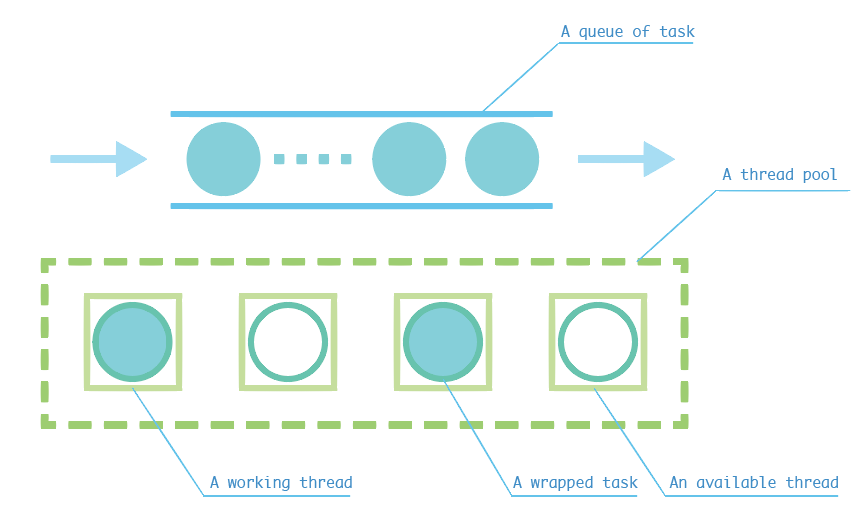

# Thread Pool using C++
A small project following [实验楼](https://www.shiyanlou.com/courses/565) tutorial.

## Getting Started

### Prerequisites

To run this code, you need the following tools:
- gcc (that support C++11)
- make

### Installing

To simply run it, you can just `cd` to the `thread_pool` directory and run:
```
make
```

To generate the excutable file but not run it, just run:
```
make test
```

and run it with:
```
./test
```

## Explanation

### General idea
 

With the help of the above image, we now get a general idea about what a thread pool is. As for me, I treat it as a number of containers, each of which can accomodate a task and run it simultaneously. As you may ask, why we need a thread pool. Well, if you just know how many task you have, or your computer is quite high-performance, you can just create one thread for each task and wait. Of course, there is a more elegant way like this. You create a certain number(denote as `k`) of threads, and you run at most `k` tasks at one time.

If you have viewed the code in `threadpool.hpp`, you may know that there are only three main functions: `ThreadPool()`/`~ThreadPool()`/`enqueue(funcname, all its arguments)`. And we will start explaining them one by one.

### Construct function
```
ThreadPool(size_t threads);
```

The construct function only receive one argument, that is, the number of 'containers' in the thread pool. If you know about thread before, you may think that a thread can run only one function. Then how can we use the same thread for more than one task? Well, if you look closely into the image above, you may find a little difference between the circle in the `task queue` and 'thread pool'. There is a ring 'wrapping' the task.

The ring means a wapper function. And the ring is what a thread is really running. The ring is the function that is `emplace_back()` into a thread pool. In the ring there is an eternal loop, in which it detects if there is some task in the task queue and run it if there is any. If there is no task, it will wait for a signal.


### Destruct function

In fact, I think it is quite obvious. Before a ThreadPool objects dies, it has to finish all its tasks. The member variable `stop` shows if the TheadPool is to die.


### Enqueue function

This is the most difficult function in this project. I'm not sure if I can explain it well. First, let me ask a question. If the task has some return value, how could we get it? The trick here is when you `enqueue` some task, you will get a `future` object. It is like when you go to some restaurant in china, after you order sth., you will get a receipt. And you can then go to get your food by it when the food's ready. The `future` object's funtion is similar, you can get the return value through it when it's ready. Otherwise, you may be blocked. 

If you understand the main idea of the `enqueue` function is to push the task in to the task queue and return a future object, it's quite enough. Besides are all techinal things: You have to transform the `function` type into a `packaged_task` type in order to get the `future` object, and to notify a thread after enqueue.

### Other things
I omit the lock in the code. In fact, the `enqueue` and the running of the task contend for the same lock. That is, when all the containers are running tasks, the `enqueue` function will be blocked and it will unblock and notify a random container when some of the container is availabe.


## Author's comment

I have to admit that I myself is a beginner and maybe sth. is wrong in the article above. Welcome to contact me(email:huangsunyang@126.com) if you have some question or advice. The tutorial is free to use and I recommend you to use 实验楼 since many of the project in this directory is from that website.
